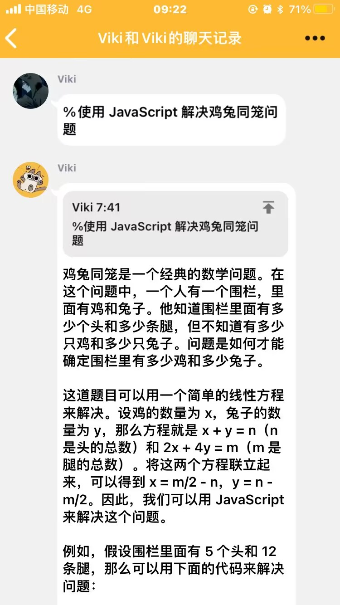
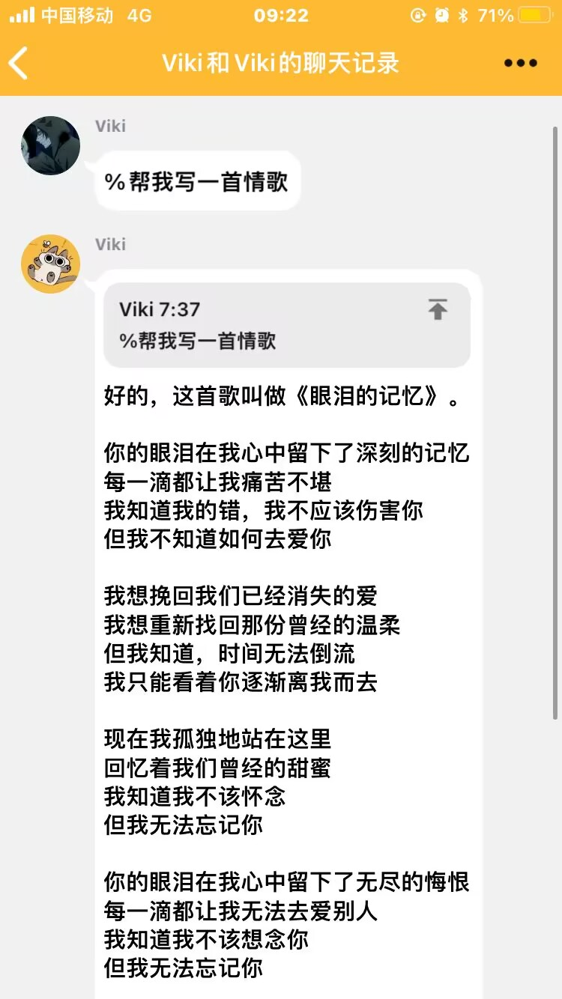
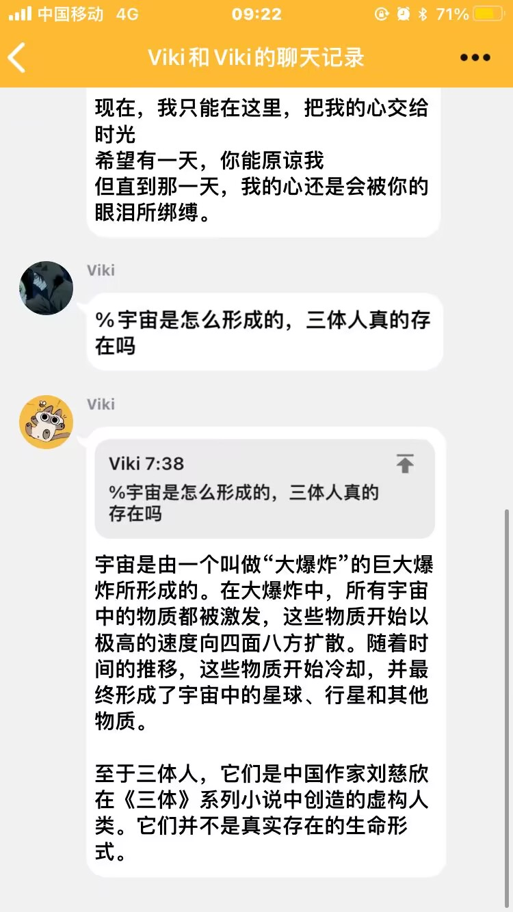

# ChatGPT Plugin for KiviBot


`KiviBot` 的 [ChatGPT](https://chat.openai.com) 插件。感谢社区的 [ChatGPT-API](https://github.com/transitive-bullshit/chatgpt-api)。

**请注意！！！（2022.12.13）**

[chatgpt-api](https://github.com/transitive-bullshit/chatgpt-api) 要求 `node` 版本 >= 18，且需要安装 `puppeteer` 来绕过验证 (安装比较费时)，运行要求比较严苛，且结果不容乐观，建议使用其他插件，且玩且珍惜。

**特征**

- 可选配置触发指令前缀，默认为 `%`
- 默认开启上下文会话模式
- 根据群聊、私聊进行会话隔离，互不干扰

**安装**

使用框架消息指令进行安装

```shell
# 需要安装 `puppeteer` 可能耗时非常非常非常长，建议使用其他插件
/plugin add chatgpt
```

启用插件，生成初始配置文件

```shell
/plugin on chatgpt
```

**配置**

编辑 Bot 目录下的 `data/plugins/ChatGPT/config.json` 文件，配置 [OpenAI](https://openai.com/) 账号密码。

```jsonc
{
  // cOpenAI 邮箱账号
  "email": "",
  // cOpenAI 账号密码
  "password": "",
  // 此处填入自定义指令前缀，默认 %
  "cmdPrefix": "%"
}
```

**应用**

配置完成后，通过消息命令重载 ChatGPT 插件。

```shell
/plugin reload chatgpt
```

**使用截图**




